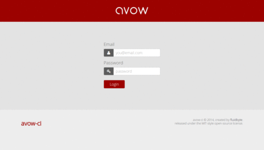

# Avow-CI



A simple yet powerful open-source CI system for individual developers, small teams
and dev shops, specifically designed for JavaScript projects.

Avow is built for customization - creating continuous integration (and deployment) 
that fits your specific need. It's easy to hack on and makes it simple to crete 
solutions that fit your needs.

## Requirements

* [NodeJS](http://nodejs.org) v.0.9.0 (or better)
* [MongoDB](http://www.mongodb.com/) locally or via a service such as [MongoLab](http://mongolab.com)

## Installation

1.) After cloning or downloading the contents of the Avow system to your server run
`npm install` to get all dependencies.

*Note: If you're planning to run in dev mode (i.e. `node index.js`) you need to
additionally run `npm install grunt-cli -g`.

2.) In the root of the directory create a file `db_conf.json`:

```json
{
  "adapter": "mongo",
  "config": {
    "host": "[MONGO_HOST]",
    "database": "[DATABASE]",
    "user": "[USER]",
    "pass": "[PASSWORD]"
  }
}
```

Replacing the `[VARIABLES]` with your Mongo connection information.

3.) Create a user by running the following command:

```
node adduser.js [user@email.com] [password]
```

This will create a user based on the email address and password provided

4.) Start the service:

```
npm run prod
```

## Configuring Mail Service

Avow has the ability to send email notifications to users when a build fails. To
enable this capability you must create a `mail_conf.json` file in the root:

```json
{
    "server": "[AVOW_SERVER]",
    "host": "[SMTP_SERVER]",
    "secureConnection": true,
    "port": 465,
    "auth": {
        "user": "[SMTP_EMAIL]",
        "pass": "[SMTP_PASSWORD]"
    },
    "maxConnections": 5,
    "maxMessages": null
}
```

*Note: the `AVOW_SERVER` refers to the FQDN/IP for your Avow instance. This is used
to build return links from the outgoing email back to the failing build and should
be formatted like: `http://yourserver.com:8181`.*

## Accessing the Web App

The default port (which can be changed in `/config.js`) is `8181`, so when the
server is running you can access the web app via `http://yourserver.com:8181`.

You can then log in with the email address and password you created during installation.

## Configuring Projects

Projects utilize an `avow.json` file in their root directory to inform the build
process of tasks to run. This file needs to be added to any project's repository
which will be added to the system.

A simple example of the `avow.json` file can be seen below:

```json
{
    "tasks": [
        "npm install",
        "grunt"
    ]
}
```

The above would clone the repo and then run the tasks (in order) to complete the
build.

Once the project has an `avow.json` configuration it can be added to the system:

From the main (Project List) screen you can click "New Project" to add a new
project to the system. The "Project Config" screen will ask for 3 things:

1. **Name:** This should consist of letters, numbers, and hyphens only and is used to reference the project
2. **Repo:** The SSH repository clone URL
3. **Branch:** If a valid SSH repo URL is supplied this will be a dropdown with the list of available branches

If the project is in a private repository you will need to add a deploy key. You
can simply use the server's `.ssh/id_rsa.pub` key for this (if it exists) or
[generate one](https://help.github.com/articles/generating-ssh-keys).

Once you have a deploy key simply add it to the repository in GitHub under the
Settings >> Deploy Keys.

Alternatively, if you are running multiple repos (not just multiple branches) it
may be easier to associate the server's pub-key with your Github account, or create
a Github account for your server which has access to the repos you will be adding.

## Running Builds

There are two ways to run builds through Avow:

### Manual Run:

In the main "Project List" screen you can manually run a build by clicking the icon
in the "Build" column. This will start the build then direct you to the build page
where the build can be monitored.

### GitHub WebHook:

For the project to run whenever a commit is pushed to the repo + branch you can
add a webhook in GitHub under the Project Settings >> Webhooks & Services with the
following settings:

| **Payload URL**                         | **Payload Version**              |
|-----------------------------------------|----------------------------------|
| `http://yourserver.com:8181/api/build/` | `application/vnd.github.v3+form` |

Once these settings are in place the system will automatically process incoming
webhook `POST`'s and execute a build.

## License

This software is released as-is, without warranty under the MIT-Style license.
