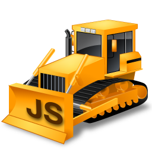

# DozerJS

Dozer is a system for rapidly developing services to support front-end applications.

It's not a framework, not a toolkit, rather Dozer aims to be a maleable and
unopinionated foundation for developing RESTful API's and web services to support
front-end development.

Dozer creates a core server environment using [NodeJS](http://www.nodejs.org) and
the [Express framework](http://expressjs.com) then allows you to build api endpoints,
database models, components and adapters which all work together to provide the
services required on the front-end.

---

# Getting Started

**Quick Start**

DozerJS has an [npm available](https://www.npmjs.org/package/dozerjs) to make
creating new instances simple. To get started install the npm globally:

`npm install dozerjs -g`

Then simply run the `dozerjs` npm via the following:

`dozerjs create NewProject`

Which will create the project with all neccesary assets and dependencies in the
directory `./NewProject`.

For additional information on using the command client please visit the
[npm page](https://www.npmjs.org/package/dozerjs).

---

**Manual Installation**

To get the foundation up and running simply clone it locally then run `npm install`
to install the dependencies.

---

# License

DozerJS is released under the MIT-style license and as such is open to modification
and redistribution based upon the terms of the license.

---

# More Information

For more information on DozerJS, usage, concepts and examples please visit the
[DozerJS website](http://www.dozerjs.com).